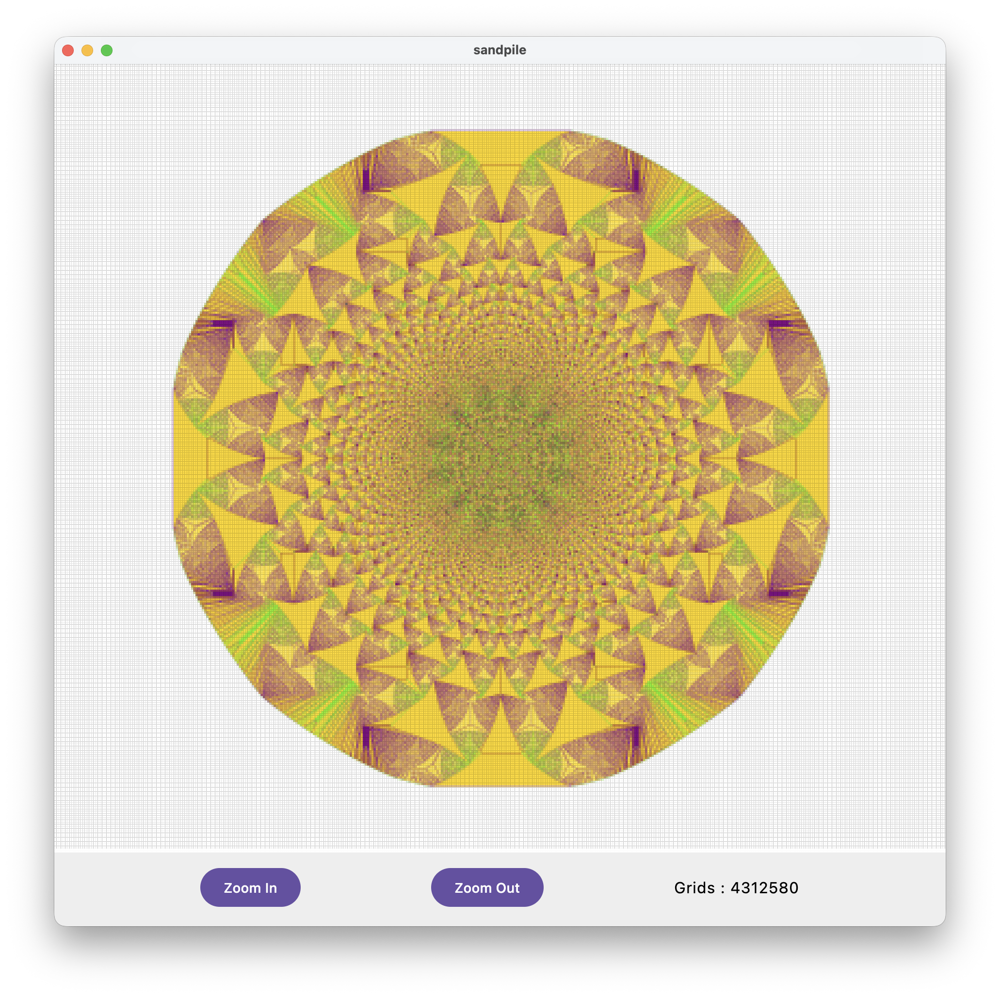
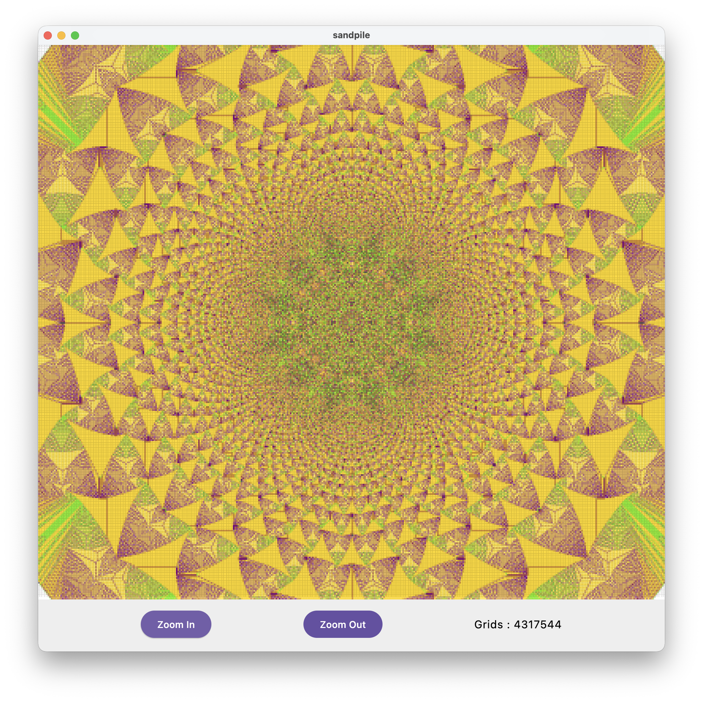
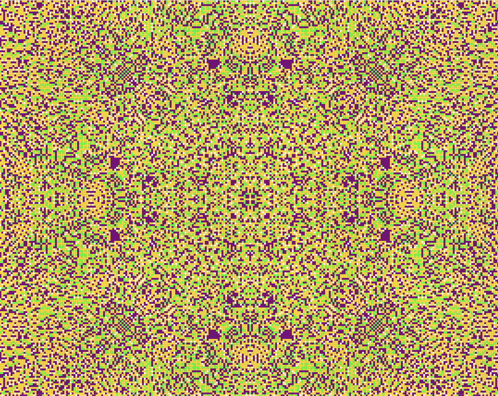

# Abelian Sandpile Model - Mandala Visualization

  

**Kotlin Multiplatform + Compose** 實現的阿貝爾沙堆模型（Abelian Sandpile Model），可同時編譯為：

- macOS / Windows / Linux 桌面應用
- 瀏覽器 WebAssembly (Wasm) / Kotlin/JS 版本

最終在瀏覽器中呈現出美麗的**曼陀羅（Mandala）**般對稱圖案。

## 線上體驗

直接在瀏覽器開啟（推薦 Chrome / Edge / Safari 最新版）：

→ **[https://neojou.github.io/mandala/sandpile/](https://neojou.github.io/mandala/sandpile/)** ←

## 什麼是 Abelian Sandpile Model？

這是一個經典的**細胞自動機**模型：

1. 有一個格子平面，每個格子可以堆積「沙粒」
2. 每次隨機（或指定）加一粒沙到某個位置
3. 當任一格子的沙粒數量 ≥ 4 時，該格子會「崩塌」：
   - 自己失去 4 粒
   - 上下左右四個鄰居各得到 1 粒
4. 崩塌可能引發連鎖反應，直到所有格子穩定（< 4 粒）
5. 重複大量加沙後，會自然形成極為對稱、 fractal 風格的曼陀羅圖案

這個模型有趣的地方在於：規則極簡單，卻能產生高度複雜、自組織的美麗結構。

## 這個專案做了什麼？

- 使用 **Kotlin Multiplatform** 共享核心邏輯
- 使用 **Compose Multiplatform** 繪製畫布（桌面 + Web）
- 支援 WebAssembly 編譯，效能比純 JS 更好
- 簡單的互動介面：開始/暫停、重置、單次加沙、手動點擊加沙等
- 色彩映射讓不同高度的沙堆呈現曼陀羅般的漸層美感

## 專案結構（簡要）

```text
sandpile/
├── src/
│   ├── commonMain/         # 共享邏輯：沙堆模型、狀態計算
│   ├── desktopMain/        # JVM 桌面應用入口
│   ├── wasmMain/           # WebAssembly / Compose for Web 入口
│   └── ...                 # 其他可能的 source sets
├── build.gradle.kts
└── settings.gradle.kts

```

## 如何在本地執行

1. 需要安裝 **IntelliJ IDEA**（推薦）或 Android Studio
2. 支援 JDK 17+（建議 21）
3. Clone 專案

```bash
git clone https://github.com/neojou/sandpile.git
cd sandpile
```

4. 執行桌面版

```bash
./gradlew :composeApp:run
```

5. 編譯並產生Web 版本

```bash
./gradlew wasmJsBrowserDistribution
```

產出物會在 composeApp/build/dist/wasmJs/productionExecutable/
可使用簡單 http server 開啟（或直接拖進瀏覽器）

# 範例：使用 python
python3 -m http.server 8000 --directory build/dist/wasmJs/productionExecutable

然後開瀏覽器：http://localhost:8000


### 執行結果

隨著掉落的沙子增加, 圖案會一直擴大變化, 但又有自相似性
  
  

### 相關閱讀

網誌介紹（中文）：
[2026 和 AI 一起寫程式 - 4. 沙堆模型 Abelian Sandpile Model 曼陀羅](https://njiot.blogspot.com/2026/01/2026-ai-4-abelian-sandpile-model-mandala.html)

經典文獻與更多視覺化範例可搜尋：
"Abelian sandpile model identity" / "sandpile mandala"

### 目前進行中
新增按鈕：Start, Stop

### 未來可能方向

加入更多配色方案
支援不同崩塌規則
- 目前是4崩塌, 可改其他數字
- 隨機掉落沙子, 而不是總在中心點
- 六角格
- 隨機鄰居
錄製生成過程的動畫 / GIF 輸出

歡迎 Issue / PR / Fork 一起玩沙！

